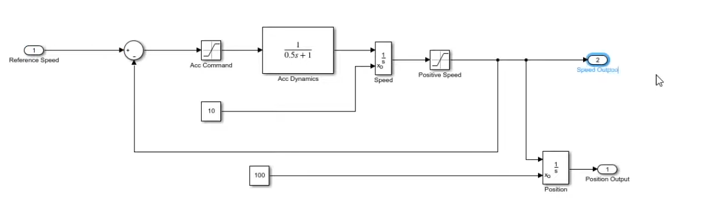

# Autonomous Vehicle Modeling   

## vehicle model
the vehicle dynamique model inspired from : [Adaptive Cruise Control System Using Model Predictive Control](https://www.mathworks.com/help/mpc/ug/adaptive-cruise-control-using-model-predictive-controller.html)
 

# Dashbord of the vehicle 
 
# PID cruse Control 
 
## PID BLOCK
 

# Adaptive cruise control 
[Model Predictive Control Toolbox™, User's Guide](https://www.mathworks.com/help/pdf_doc/mpc/mpc_ug.pdf)
 
## ACC result for the vehicle model
 

# 2D Animation
2D animation to vesulise the trajectoire of the 3 vehicle on (x,y) cordonnier

 

